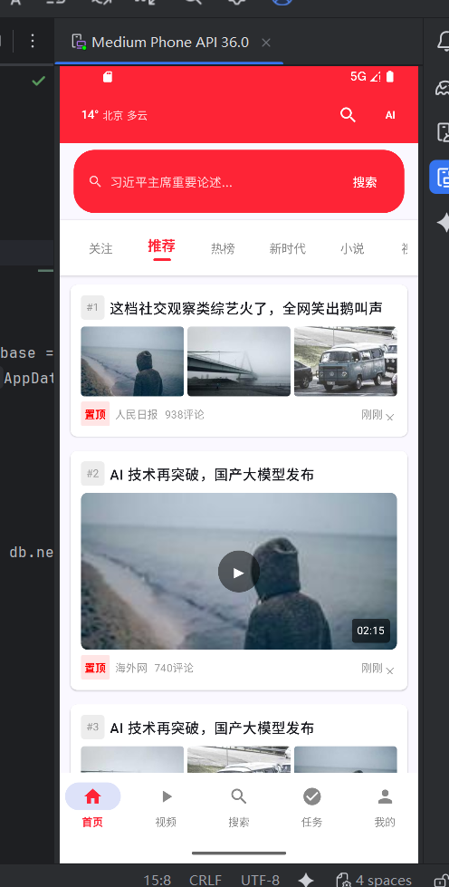
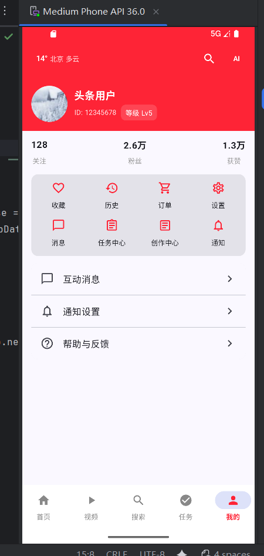

# ToutiaoLite (头条精简版)

- 项目定位：使用 Jetpack Compose + MVI/MVVM 架构，高保真还原“今日头条”首页新闻流的交互体验。
- 技术栈：Kotlin、Jetpack Compose(Material3)、Room、Hilt、Coroutines/Flow、Coil；Min SDK 24；Gradle（Kotlin DSL）。

## 展示

  
  
  

> 左侧为首页新闻流，右侧为用户中心页，用于展示整体结构与风格。

## 功能概览
- 多布局新闻卡片：纯文本、右侧单图、视频、三图；支持置顶与编号显示。
- 列表能力：渲染稳定 key、下拉刷新、触底加载更多（迟滞触发、护栏避免重复）。
- 状态管理：加载中/刷新中/加载更多/错误态（错误页待补充）。
- 数据一致性：Room 作为单一信源，UI 通过 Flow 订阅数据库快照，避免刷新/分页后重排与跳屏。

## 架构说明
- 模式：MVI + MVVM（单向数据流 + 分层职责）。
- 交互方式：视图仅根据状态渲染；用户操作以意图（Intent）形式发送给 ViewModel；Repository 统一提供数据并写入数据库；UI 订阅状态流并重绘。

## 开发与运行
- 使用 Android Studio 打开项目并运行应用（Mock 数据源，后续可接入网络）。

## 演示视频
- 演示视频位于项目的媒media文件夹中（TinyToutiao 展示视频）

