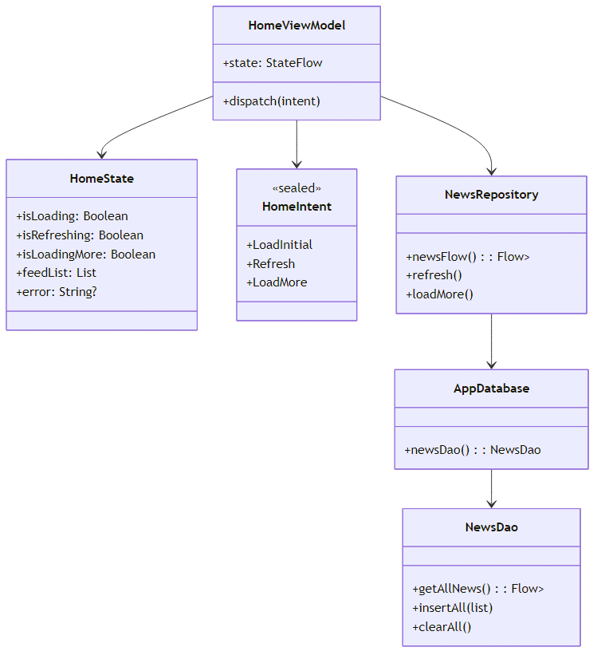
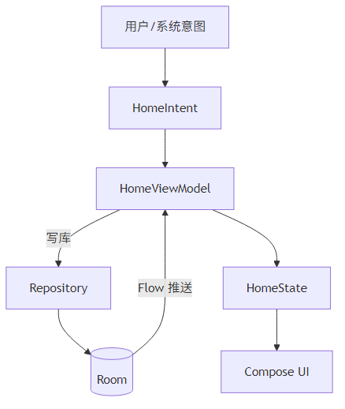

# 技术文档

仓库地址：[https://github.com/2275486193/toutiao-](https://github.com/2275486193/toutiao-)
本技术文档面向开发者与评审人员，系统说明项目的目标、架构设计、实现细节、功能阐释、运行与评估标准，并提供展示截图以辅助理解。
## 展示概览

[图片]
[图片]

左图为首页新闻流，右图为用户中心页。两图并列展示整体结构与风格。
## 视频展示
暂时无法在飞书文档外展示此内容

## 一、项目概述与目标

- 目标：以 Kotlin + Jetpack Compose 实现“今日头条”首页新闻流的高保真交互 Demo，采用单向数据流（MVI/MVVM），以 Room 为单一信源，确保 UI 仅为状态的映射。
- 侧重点：列表稳定性、刷新与分页体验、右侧滚动条交互、切页返回保留滚动位置。
- 架构收益：解耦（UI 不直接触达数据层）、可测试（Intent→State 可预测）、易演进（Mock 与网络切换对 UI 无感）。
## 二、技术选型

- 语言与框架：Kotlin、Jetpack Compose（Material3）。
- 数据与持久化：Room（含 Gson TypeConverter）。
- 依赖注入：Hilt。
- 并发与响应：Coroutines/Flow（StateFlow/Flow）。
- 图片：Coil。
- 构建：Gradle Kotlin DSL；Min SDK 24。
## 三、架构与实现方式

- 意图层：HomeIntent 定义用户/系统意图（初始加载、下拉刷新、触底加载）。
- 状态层：HomeState 维护屏幕单一状态（isLoading、isRefreshing、isLoadingMore、feedList、error）。
- 视图模型：HomeViewModel 接收意图，协调数据流；通过仓库写入/读取数据库并驱动状态变更。
- 仓库与数据源：Repository 作为单一信源，统一“写库 → 读库 Flow”；数据源当前为 Mock，可替换为网络层。
- UI 层：Compose 订阅状态并进行声明式渲染，仅响应状态变化。

### 3.1 UML结构

### 3.2 数据流示意

## 四、模块结构与职责

- UI 层：首页框架、搜索栏、频道导航、列表与各类卡片、底栏页签、右侧滚动条、“我的”页。
- 视图模型层：意图分发、状态流维护、刷新/分页控制与护栏。
- 数据层：Mock 数据生成、仓库（读写库）、Room（DAO/Database/TypeConverter）。
## 五、数据与存储设计

- 持久化模型：新闻实体包含 id/title/source/commentCount/publishTime/type/imageUrls/videoDuration/isTop 等字段；imageUrls 使用 JSON 持久化并通过转换器读写。
- 单一信源：仓库在刷新/分页时，仅通过“写库 + Flow 读库”驱动 UI，不直接向 UI 返回临时集合，保证一致性与可维护性。
- 排序稳定：DAO 按插入顺序返回，避免刷新或分页后列表重排导致跳屏。

## 六、状态与数据流

- 首次加载：应用启动即派发“初始加载”，仓库生成 Mock 写库；UI 订阅 Flow 并渲染为卡片列表。加载指示通过 isLoading 呈现。
- 下拉刷新：isRefreshing 控制刷新视觉；引入 2 秒冻结窗口以提升可感知性，后以数据库快照更新 UI，避免刷新期间列表闪动。
- 触底加载：页脚可见区域至少 32dp 且稳定两帧，触发“加载更多”；isLoadingMore 护栏避免重复触发；数据末端追加，不破坏当前视口。
## 七、功能阐释

### 7.1 首页框架与导航

- 顶栏：主题色与搜索入口占位；可扩展天气/发布/AI 等入口。
- 频道导航：单行滚动 Tab，选中态红色指示条；后续可绑定频道过滤数据源。
- 底栏：五个页签；切换后返回首页保留列表滚动位置。
- 相关 API：LazyRow（频道滚动）、状态记忆与选中态控制。
### 7.2 列表与卡片类型

- 列表：LazyColumn 使用稳定 key 渲染，卡片之间最小化间距保证紧凑信息密度。
- 卡片类型：
  - 纯文本卡：标题与元信息（来源、评论数、发布时间）。
  - 右图卡：右侧单图配文，图像裁剪与圆角处理。
  - 视频卡：封面、播放浮层与时长角标。
  - 三图卡：三图并列裁剪，强调多媒体信息密度。
- 置顶与编号：前若干条置顶；标题左侧支持 #序号 标签辅助测试与调试。
- 相关 API：LazyListState（滚动位置保持）、稳定 key（避免重排）。
### 7.3 下拉刷新与位移联动

- 刷新容器与内容位移（translationY）联动，释放后回弹，刷新状态与视觉反馈一致。
- 相关 API：刷新容器状态、graphicsLayer（位移联动）。
### 7.4 触底加载与静态性

- 迟滞触发：页脚足够可见且稳定两帧才触发，避免“刚露出即加载”。
- 静态约束：非刷新/加载场景不主动更新或重排；分页仅末端追加，确保视口稳定与滚动连贯性。
- 相关 API：LazyListState.layoutInfo（可见项与视口数据）。
### 7.5 右侧滚动条

- 轨道与拇指：自绘轨道、拇指高度与位置按可见项比例动态计算。
- 动效：滚动中淡入，停滞后淡出；点击或拖拽仅拇指区域有效，提升命中准确性。
- 快速定位：点击/拖拽拇指以按比例定位目标项，实现长列表快速导航。
- 相关 API：animateFloatAsState/tween（显隐与位移动效）、pointerInput + 手势（点击/拖拽）、scrollToItem（按比例跳转）。
### 7.6 滚动位置保持

- 切换底部页签后返回首页，列表滚动状态保持，提升跨页面操作连续性。
- 相关 API：rememberLazyListState（滚动状态记忆）。
### 7.7 滚动条方案对比与取舍

- 原生滚动条：通过视图系统列表启用系统滚动条（Compose 互操作嵌入）。优点是行为成熟、维护成本低；取舍是引入混合栈。
- Compose 自绘优化：保留纯 Compose，精确计算拇指位置、提升命中与动效；取舍是需要长期调优。现阶段可保留自绘并记录优化方向；如需快速稳定交付，采用原生方案。

## 八、工作拆分与排期

- 第 1 周：初始化项目，配置环境，完成前端搭建
- 第 2 周：完成刷新、加载，数据呈现等交互细节，进行bug修复
## 九、操作与运行

- 快速启动：克隆项目 → 使用 Android Studio 打开 → 运行 app 配置；或使用 Gradle Wrapper 构建与安装。
- 构建：clean 后 assembleDebug（可跳过测试）生成调试包。
- 安装：installDebug 安装至连接设备或模拟器。

## 十、常见问题（FAQ）

- 列表空白：检查依赖注入与数据库初始化；确保仓库写库与 Flow 订阅正常。
- 刷新无感：确认刷新状态持有窗口与 UI 渲染逻辑一致。
- 触底未触发：页脚可见阈值与稳定帧数是否满足、isLoadingMore 护栏是否释放。
